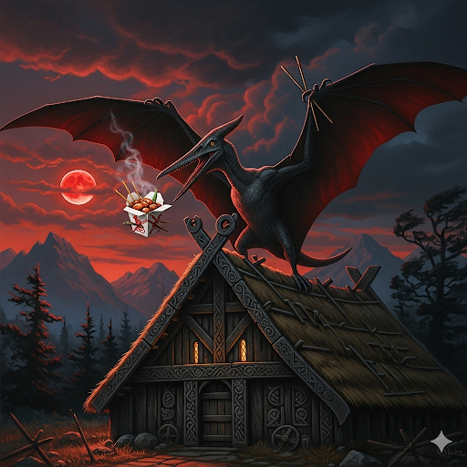

# Docker Valheim Server Images

Multi-architecture Valheim dedicated-server image built on
[`docker-steamcmd-server`](https://github.com/Teriyakidactyl/docker-steamcmd-server).
The shared base owns SteamCMD updates, architecture adaptation, process
supervision, health checks, and lifecycle hooks; this image supplies the Valheim
runtime contract and operator-facing configuration.



## Features

- `amd64` and `arm64` images from the same Valheim configuration
- Box64 execution on `arm64`, supplied by the shared base
- Non-root game execution
- SteamCMD update-on-start with persistent application state under `/app`
- Persistent worlds and permission files under `/world`
- Argument-safe server names, world names, and passwords
- Graceful Valheim shutdown using `SIGINT`/CTRL+C semantics
- Environment-driven permitted-list reconciliation

## Configuration

| Variable | Default | Purpose |
| --- | --- | --- |
| `SERVER_NAME` | `MyValheimServer` | Name advertised by the server |
| `WORLD_NAME` | `Teriyakolypse` | World name passed to `-world` |
| `SERVER_PASS` | `MySecretPassword` | Server password |
| `SERVER_PUBLIC` | `0` | `0` for private/unlisted, `1` for public |
| `SERVER_PORT` | `2456` | Base game port; Valheim also consumes this port + 1 |
| `STEAM_ID_ALLOW_LIST` | empty | Comma- or newline-separated Valheim Platform User IDs to project into `permittedlist.txt` |
| `SERVER_ALLOW_LIST` | empty | Legacy compatibility alias for `STEAM_ID_ALLOW_LIST` |
| `STEAM_ID_ALLOW_LIST_PATH` | `/world/permittedlist.txt` | Optional canonical permitted-list path override |
| `UPDATE_ON_START` | `true` | Run SteamCMD update before launch |
| `STEAM_VALIDATE` | `false` | Ask SteamCMD to validate the server installation |
| `SHUTDOWN_TIMEOUT` | `30` | Seconds the shared supervisor waits for the Valheim process group before escalation |

Valheim permission files use Platform User IDs, not SteamID64-only values. The
current upstream format is `[Platform]_[User ID]`, one entry per line. When an
environment allow-list is populated, the container manages the target
`permittedlist.txt`. Clearing a value previously managed by the container
removes that managed file. If no environment allow-list has claimed the file, an
operator-created `permittedlist.txt` is left untouched.

The historical `STEAM_ALLOW_LIST_PATH` variable is accepted as a path
compatibility alias, but new deployments should use `STEAM_ID_ALLOW_LIST_PATH`.

## Usage

```bash
UR_PATH="/root/valheim"
mkdir -p "$UR_PATH/world" "$UR_PATH/app"

docker run -d \
  --name Valheim-Server \
  --restart unless-stopped \
  --stop-timeout 45 \
  -e SERVER_NAME="My Server" \
  -e WORLD_NAME="Teriyakolypse" \
  -e SERVER_PASS="secret password" \
  -e SERVER_PUBLIC="0" \
  -v "$UR_PATH/world:/world" \
  -v "$UR_PATH/app:/app" \
  -p 2456-2457:2456-2457/udp \
  ghcr.io/teriyakidactyl/docker-valheim-server:latest
```

The argument file preserves values such as `My Server` and `secret password`
as single Valheim arguments instead of re-tokenizing them through a shell
string.

## Persistence

| Path | Purpose |
| --- | --- |
| `/app` | Valheim dedicated-server installation and shared-base Steam state |
| `/world` | Worlds, backups, permission files, and other save-path state |

Keep both paths persistent across container recreation.

## Shutdown

Valheim's upstream server guidance requires CTRL+C for a clean stop. The image
therefore sets `APP_STOP_SIGNAL=INT`. The shared supervisor sends that signal
to the complete launched process group and waits up to `SHUTDOWN_TIMEOUT`
before escalating. The Compose example uses a 45-second Docker grace period so
Docker's outer timeout exceeds the image's 30-second internal shutdown ceiling.

## Health check

The inherited health check verifies that the launched Valheim process recorded
by the shared supervisor is still alive.

## Building

```bash
docker build -t ghcr.io/teriyakidactyl/docker-valheim-server:latest .
```

`BASE_TAG` defaults to `bookworm`; `trixie` is also published.

## Image tags

The main build matrix publishes `bookworm` and `trixie` multi-architecture
manifests plus architecture-specific variants such as `bookworm-amd64` and
`trixie-arm64`. `latest` tracks the main-branch `bookworm` image.
Development branch builds use `_dev` on the base-family tags.

## Upstream server behavior

Iron Gate's dedicated-server guide documents the current command-line,
permission-file, port, persistence, and shutdown behavior:
<https://valheim.com/support/a-guide-to-dedicated-servers/>.

## Support

For issues, feature requests, or contributions, use this repository's GitHub
issue tracker.
